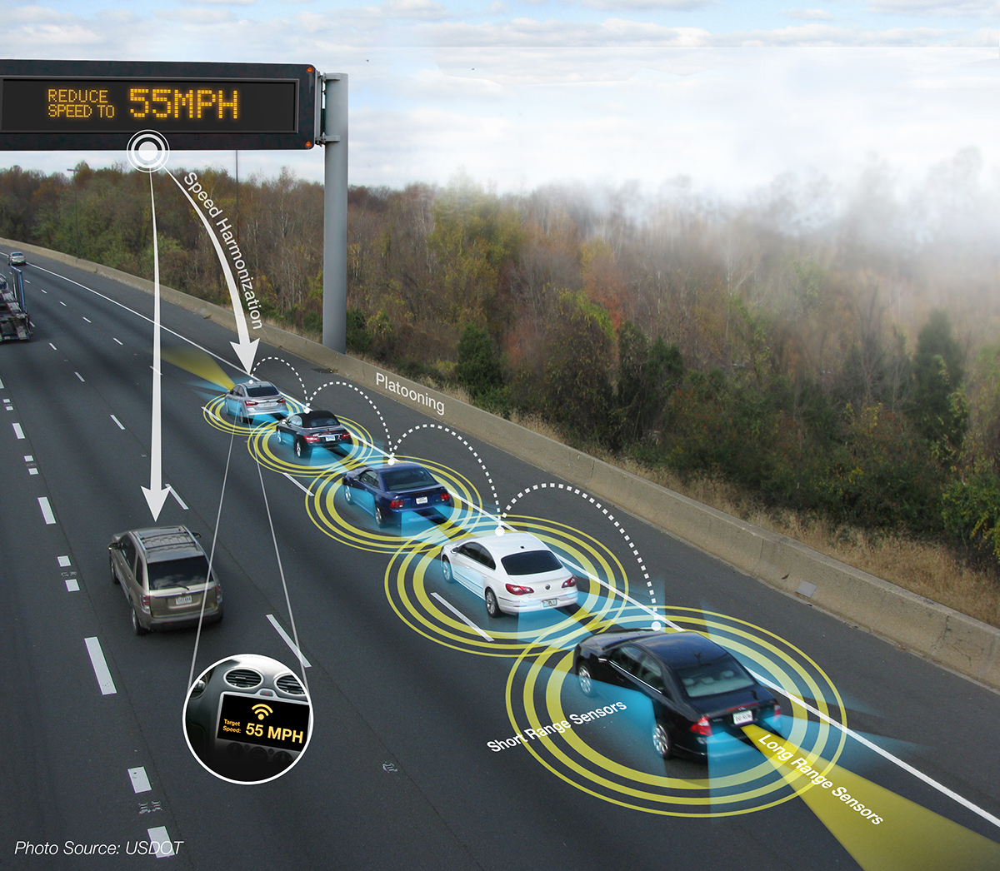
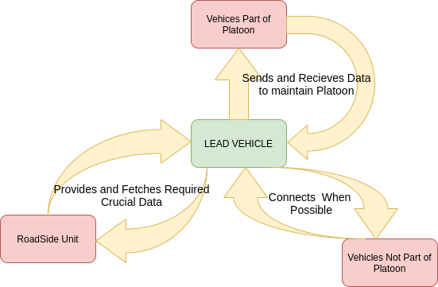
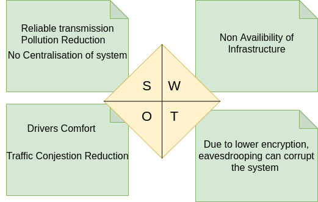

# Introduction

The basic problem statement of the project is inefficient traffic congestion. Due to asynchronous traffic mobility channel contension is higher which leads to reduced traffic efficiency in roads along with much higher time and fuel consumption.

# Dynamic Vehicle Platoon Formation

The platooning concept can be defined as a collection of vehicles
that travel together, actively coordinated in formation.

# Advantages

* Increase of road capacity
* Reduction of environmental impacts
* Improved safety
* Improved driver comfort

# Defining the System

The lead vehicles always interacts with other vehicles to 
* Either include an extra vehicle into platoon or exclude existing vehicle from platoon
* To provide and fetch infromation about environment with RSU (Road Side Unit).

# Features
## Reliability
Reliability is very important in vehicle platooning because a slight error in data communication between nodes can create severe accidents in the highway, loosing all the advantages of the system. For this reason :

1. Sufficient Road Side Units has to be physically spaced covering maximum area
2. Encryption of data has to be increased to provide data security.
3. Curently the project runs on 802.11p but URLLC(Ultra Reliable Low Latency Communication) protocol provides better reliability.

## Scalability 

Scalability is an important parameter in this project, because according to the channel condition the number of vehicles in platoon varies. So by measuring latency maximum number of allowable vehicles can be measured.

## Cost
As it is in the development phase, it is free of cost.

## 4 W's and 1H

### WHO
This is a helpful system to every commuter present in an urban loacality.
### WHAT
We have designed an automated paltooning system that can travel efficiently in a urban network.
### WHEN
It is a 24 hrs service which is heavily dependent on infrastructures required for it to operate.
### WHERE
In any busy roads where traffic congestion is a severe issue, this system can be implemented.
### HOW
Upon idntifying the required area, robust physical communication structures has to be installed which support the system.

## SWOT ANALYSIS 

# Detail Requirements

## High Level requirements

