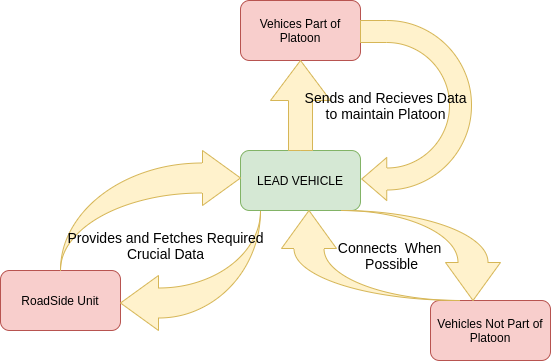

# Architecture

## Behavioral Diagram

### High Level Behavioral Diagram

### Low Level Behavioral Diagram

## Structural Diagram

### High Level Structural Diagram 

### Low Level Structural Diagram

